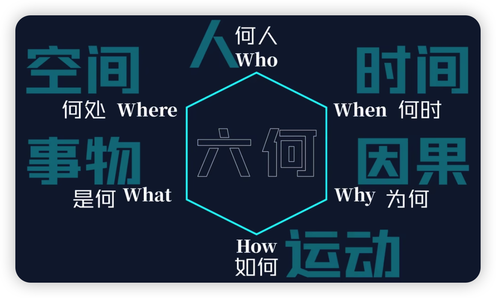
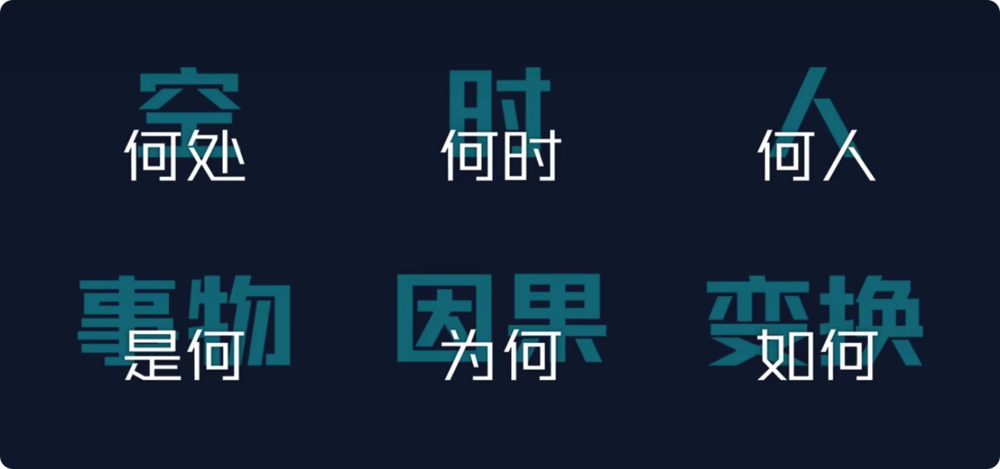
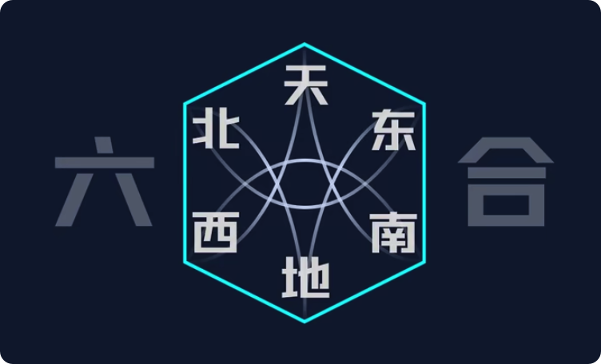

# 六何法（5W1H）

> 在使用这种无边界的模型时，只需要尽量的挖掘出更多启发，聊胜于无便是好。

发明者以五个以 W 开头的英语单词和一个以 H 开头的英语单词进行设问，发现解决问题的线索，寻找发明思路，进行设计构思，从而搞出新的发明项目，这就叫做 5W1H 法。

## 用法剖析

### 独立指导具体性工作

5W1H 可以帮助我们完成各类执行计划方案和设计创作，可以嵌套在其他模型中辅助使用（如：SWOT 分析法）；

### 作为嵌套模型使用

- SWOT 分析模型中对比竞品属性……
- 金字塔模型中协助分解一个核心问题……
- Pdca 和 Grow 模型中的行动环节里，指定周全的规划等等……

### 日常提醒，弥补思考疏漏

不要得到指令就立刻上手，先思考下六何问题的答案，再根据答案去行动；

别不知道**为啥干，怎么干**就开始干；

多使用六何查缺补漏，干活就会十拿九稳。

## 六何问题的“内涵”

六何问题并不指代具体问题，而是问题的方向，每个方向都单独归于一种属性，具有在这个属性下无尽延展各种问题的能力；

???+ question "为什么觉得用不好？"

    单一个 What 就可以对应不同的事物（），单一个 How 就可以让你提出不止一个疑问，知道问题的方向，也不一定把问题问准问全；这就会让人有一种力不从心，好像还有一些没想到的感觉。

## 最根本的思维认知

夸张的说，六何几乎可以覆盖一切存在，这就是六何法看起来很基础很简单，但又无所不能的原因

### 六合

天地四方曰六，交接聚集为何。

此六合也指天地间一切

「六何法」可问尽「六合事」，巧妙啦。

## 使用示例参考

???+ example "会议安排案例"

    - When: 会议时间
    - Where: 会议地点
    - Who: 参会人员
    - What: 会议主题
    - How: 具体环节
    - Why: 达成目的

???+ example "传播投放规划案例"

    - Why: 传播目的
    - Who: 受众人群
    - How: 渠道形式
    - What: 传播内容
    - When: 时段频次
    - Where: 投放点位
