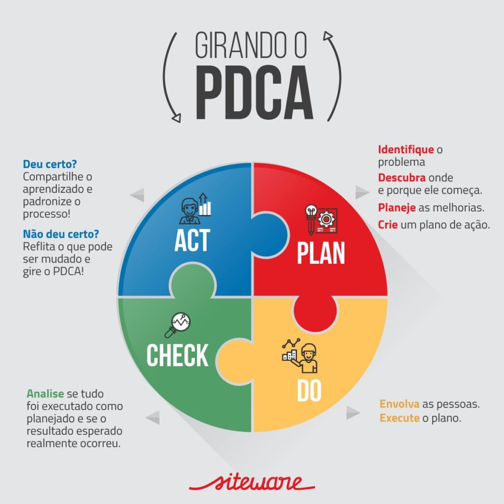
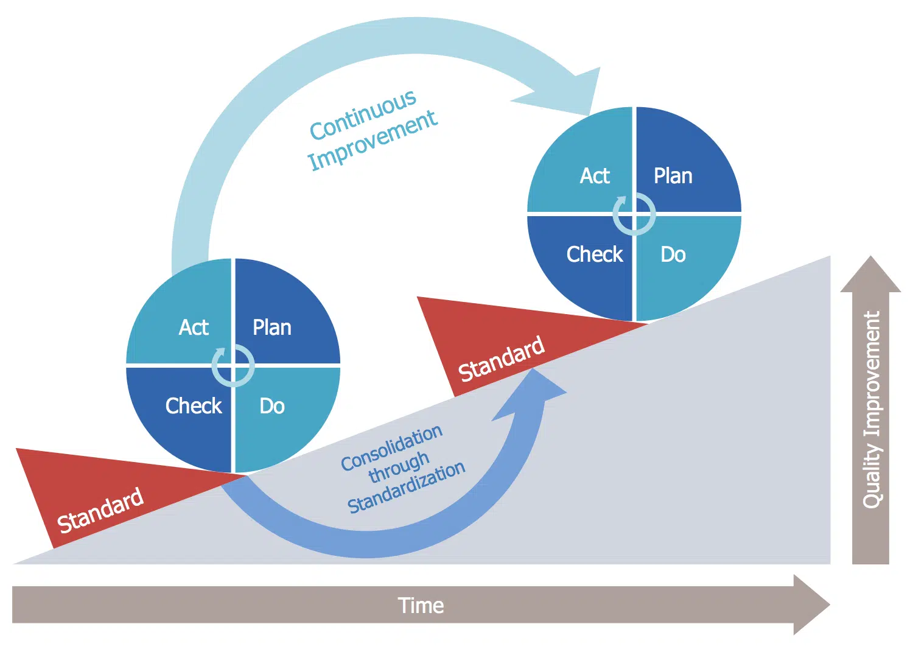

> **大小多少。图难于其易，为大于其细；天下难事，必作于易，天下大事，必作于细。是以圣人终不为大，故能成其大。**
>
> 大生于小，多起于少。处理困难要从容易的入手，实现远大要从细微的入手；天下的难事，必定从容易的做起；天下的大事，必定从细微的做起。所以有道的人始终不自以为大，因此能成就大的事情。

## 概述

管理方法何止千万种，其中戴明环在管理界广为人知，从最初的质量管理延伸至各类管理之中，进而升华为企业管理的一般规律。

戴明环，就是 PDCA 循环。最初是由美国质量管理专家休哈特首先提出的，后来由美国质量管理专家戴明所采纳、加以宣传，从美国引到日本，获得普及应用，发挥卓越效用，所以又称戴明环。

## 初级四阶

!!! note

    PDCA模型有四阶段，科学的管理程序，周而复始实现飞跃。

    - **Plan**：制定目标与计划；
    - **Do**：任务展开，组织实施；
    - **Check**：对过程中的关键点和最终结果进行检查；
    - **Action**：纠正偏差，对成果进行标准化，并确定新的目标，制定下一轮计划。

    

意义：每一项工作，都是一个 pdca 循环，都需要计划、实施、检查结果，并进一步进行改进，同时进入下一个循环，只有在日积月累的渐进改善中，才可能会有质的飞跃，才可能取得完善每一项工作，完善自己的人生。

## 由四生八

PDCA 管理循环，由四生八，从认识飞跃到实践飞跃。

一个完整且高效的 PDCA 循环，并非只是单纯的四个基本阶段；进一步细分量化，可以生成八个步骤。

!!! example "自我管理 de 由四生八"

    1. **调查研究，寻找问题。(P)**

        结合过往的不足与缺点，通过旁听观察，了解自我的发展问题，关于学习内容、工作项目等，以书面形式记录下来。

    2. **分析原因，确定主因。(P)**

        善于从全方位、多角度来分析问题产生的原因，可以借鉴5W来分析，追根溯原，抽丝剥茧，从自我身上寻找原因，究竟是关于态度不端正、动机不强烈、技能不足等方面深入思考，确定根本原因。

    3. **基于战略，目标确认。(P)**

        根据问题与原因分析，以此来结合长期的战略方向与路径，来确定长中期目标，以及目标进行分解，将目标写在墙壁上，记在心间。

    4. **制定计划，系统布局。(P)**

        三年及以上的是规划，两年及以下的就是计划，只要是计划，就应当具备运动少七个方面的要素，在管理学上，我们使用5W2H来阐述，即：Why意义、 What目标、 Who人员、Where地点、 When时间, How to do实施方法、 How much费用预算。以此来确定计划书，包含具体的行动方案与各种表单图表等。

    5. **组织资源，执行目标。(D)**

        实施的具体过程，就是按照原先制定的计划，来逐一落实到位。在执行中及时记录与总结，形成月报表、年总结。

    6. **对照计划，检查评估。(C)**

        基于计划的执行情况，以及执行结束之后，自我的检查与评估，究竟在哪些方面做到位了，在哪些方面没有完成。对于自我进行打分与写评语。

    7. **明白得失，总结经验。(A)**

        目标的定义为100分，实际上自我实施之后，可能打分是80分，如此还存在20分的缺口。这就需要自我进行分析得失成败，以此来复盘总结，好的方面形成经验，不足之处汲取教训。

    8. **更新优化，修订目标。(A)**

        结合复盘结果，实时调整目标与指标，将未解决目标与问题，转入下一个阶段，如此循环、持续改进，在曲折中终将前进。

## 循环特点

- 大环套小环，一环扣一环，小环保大环，推动大循环。
- 管理循环每转动一周，质量就提高一步。
- 管理循环就是纵横交错综合的循环。

## 总结心得

!!! note "阶梯式进步"

    PDCA 循环是一种 **阶梯式进步** 的过程，一个循环运转结束，质量就会提高一步，然后再指定下一个循环，再运转，再提高，不断前进，不断提高。

    

!!! note "凡事"

    - 凡事有人负责
    - 凡事有迹可循
    - 凡事可以追溯
    - 凡事都 PDCA
    - 凡事数据说话

!!! note "PDCA 循环的 5 个原则"

    - 凡是工作必有计划
    - 凡是计划必有结果
    - 凡是结果必有检查
    - 凡事检查必有责任
    - 凡事责任必有奖罚

---

## 参考资料

- [What is the PDCA cycle? -- siteware](https://www.siteware.co/blog/methodologies/what-is-the-pdca-cycle/)

- [What is the PLAN-DO-CHECK-ACT (PDCA) cycle? -- ASQ](https://asq.org/quality-resources/pdca-cycle)

- [What is the PDCA cycle? -- Product Plan](https://www.productplan.com/glossary/pdca-cycle/)

- [高手的成长：读好书、识高人、做实事、悟思想，开新局](https://zhuanlan.zhihu.com/p/493505296)

- [沟通高手：必备特质素养、学好乔哈里窗技巧、修炼三项专业能力](https://zhuanlan.zhihu.com/p/514031052)

- [学习之初，预习是关键起点，掌握预习的方法是提高成绩的不二法门](https://zhuanlan.zhihu.com/p/579138134)
