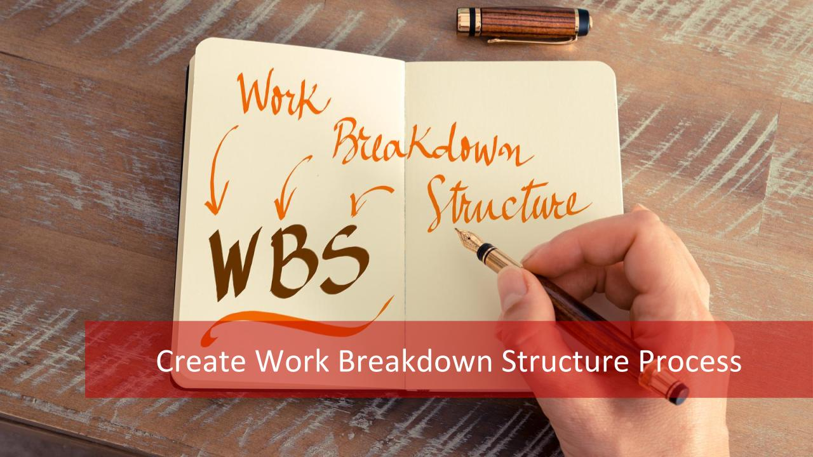

Work Breakdown Structure，如何进行 WBS 分解：目标 → 任务 → 工作 → 活动

WBS 分解的原则：

将主体目标逐步细化分解，最底层的任务活动可直接分派到个人去完成；每个任务原则上要求分解到不能再细分为止。

WBS 分解的方法：

- 至上而下与至下而上的充分沟通
- 一对一分别交流
- 小组讨论

WBS 分解的标准：

- 分解后的活动结构清晰
- 逻辑上形成一个大的活动
- 集成了所有的关键因素包含临时的里程碑和监控点
- 所有活动全部定义清楚

意义：学会分解任务，只有将任务分解得足够细，您才能心里有数，您才能有条不紊地工作，您才能统筹安排您的时间表。

---

扩展阅读：

- [What Are The 4 Aspects of Work Breakdown Structure (WBS)?](https://blog.masterofproject.com/create-wbs-process/)
- [A Guide For Work Breakdown Structure in Project Management (For Successful Projects)](https://www.proofhub.com/articles/work-breakdown-structure)
